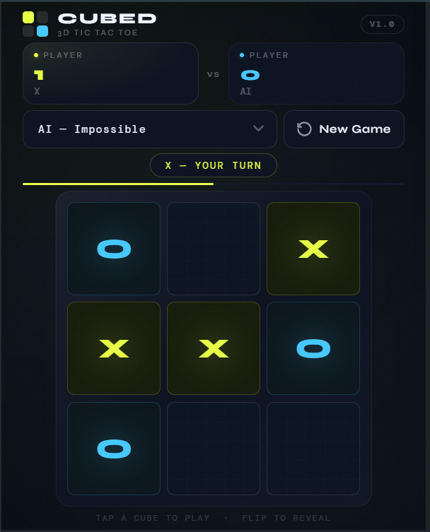
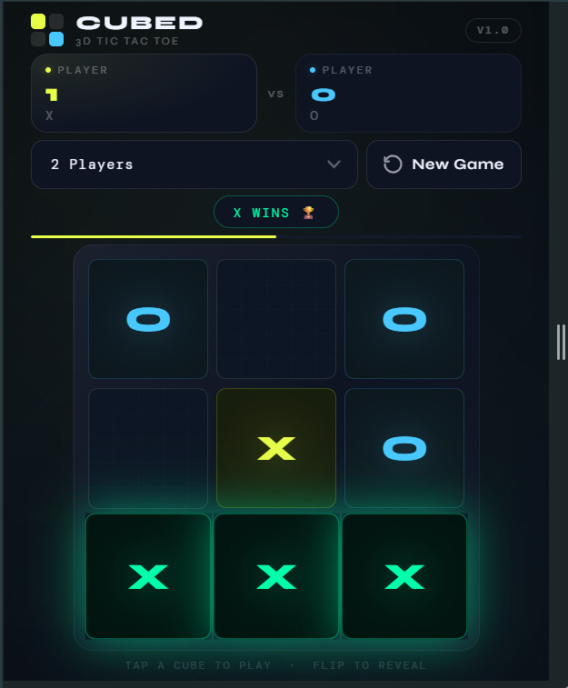

# CUBED — 3D Tic Tac Toe

> A polished, single-page Tic Tac Toe experience with 3D flip animations, an AI opponent, and a responsive dark-mode UI.

🔗 **[Live Demo → palsukanya.github.io/cubed](https://palsukanya.github.io/cubed/)**


---

## Screenshots

| Gameplay | Win State |
|---|---|
|  |  |

---

## Overview

CUBED is a zero-dependency, browser-based implementation of Tic Tac Toe. Each cell is a 3D card that flips on play, revealing the player's mark with a neon glow effect. The game supports two human players or a single player vs. an AI at three difficulty levels — including a perfect, unbeatable Minimax engine.

---

## Features

- **3D flip animations** — each cube rotates on the Y-axis when claimed, with smooth `cubic-bezier` easing
- **AI opponent** at three difficulty levels:
  - *Easy* — plays randomly
  - *Medium* — 50/50 mix of random and optimal moves
  - *Impossible* — full Minimax, never loses
- **Live scoreboard** — persists across rounds within the session
- **Turn indicator bar** — a slim animated bar that slides between players
- **Status chip** — updates with the current turn, AI thinking state, win, or draw
- **Fully responsive** — fluid layout from 360 px phones through 1400 px+ desktops, with tailored breakpoints for landscape phones and short viewports
- **Touch-friendly** — hover lift effects disabled on touch devices
- **No dependencies** — pure HTML, CSS, and vanilla JavaScript; no build tools required

---

## File Structure

```
cubed/
├── index.html   # Markup, layout structure, and Google Fonts import
├── style.css    # Design tokens, component styles, 3D transforms, breakpoints
└── script.js    # Game logic, AI engine, DOM manipulation
```

---

## Getting Started

No installation or build step is needed.

```bash
# Clone or download the repository, then open directly in a browser:
open index.html
```

Or serve it with any static file server:

```bash
npx serve .
# → http://localhost:3000
```

---

## How to Play

1. Select a game mode from the dropdown (`2 Players`, `AI — Easy`, `AI — Medium`, `AI — Impossible`).
2. Click any unplayed cube to place your mark — the cube flips to reveal it.
3. The first player to align three marks in a row, column, or diagonal wins.
4. Winning cubes pulse with a green glow. Scores persist until the page is refreshed.
5. Click **New Game** to reset the board at any time (scores are kept).

---

## AI — Technical Notes

The *Impossible* difficulty uses the **Minimax algorithm**, which exhaustively evaluates all possible game states to select the optimal move. Against this opponent:

- A perfect opponent **cannot win** — the best achievable result is a draw.
- The algorithm assigns `+10` for an AI win, `-10` for a human win, and `0` for a draw.

The *Medium* difficulty introduces variability by randomly choosing between the optimal move and a random move with equal probability, making it beatable without feeling trivial.

---

## Design System

All design tokens are declared as CSS custom properties in `:root`:

| Token | Value | Usage |
|---|---|---|
| `--x-color` | `#e8ff47` | Player X accent (yellow-green) |
| `--o-color` | `#47c8ff` | Player O accent (cyan) |
| `--win-color` | `#00ffaa` | Win state highlight |
| `--bg` | `#060a10` | Page background |
| `--surface` | `#0c1220` | Card / panel background |

Typography uses **Syne** (headings, marks) and **DM Mono** (labels, status, badges) via Google Fonts.

---

## Browser Compatibility

Requires a browser with support for CSS `transform-style: preserve-3d` and `backface-visibility`. All evergreen browsers are supported.

| Browser | Support |
|---|---|
| Chrome 90+ | ✅ |
| Firefox 88+ | ✅ |
| Safari 14+ | ✅ |
| Edge 90+ | ✅ |

---

## License

MIT — free to use, modify, and distribute.
